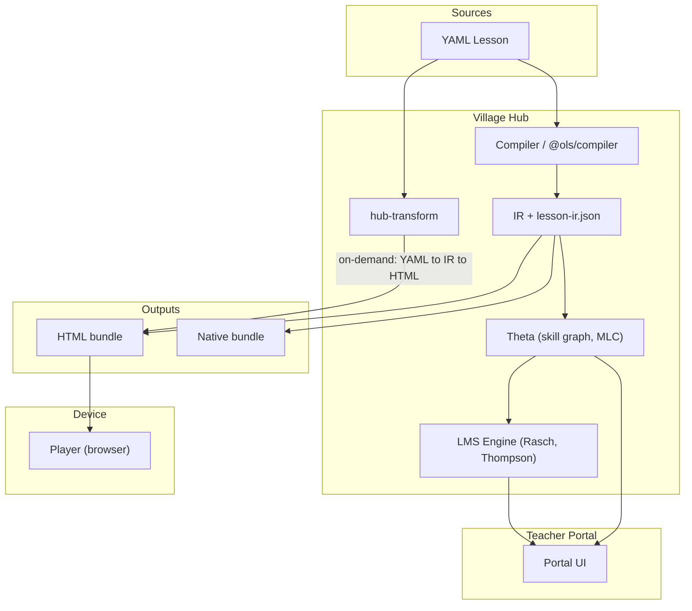

# 🏗️ Open Lesson Standard (OLS): System Architecture v2.2

**Canonical architecture document.** This file is the single source of truth for AGNI/OLS design, phases, and governance. The root `ARCHITECTURE.md` redirects here.

> Updated to reflect current implementation: hub-transform, LMS engine, governance APIs, and runtime verification are in place. **Refactor backlog completed:** LMS state migration/repair, IR and runtime types in TypeScript, runtimeManifest (feature inference decoupled from filenames), consolidated binary/base64 utilities, engine numerical modules typed via `.d.ts`, sneakernet export/import script. See `docs/ROADMAP.md` for remaining work.

---

## 1. High-Level Overview

The Open Lesson Standard (OLS) is a decentralized, offline-first protocol for interactive
education on resource-constrained hardware.

The system follows a "Source-to-Artifact" philosophy. We do not distribute heavy binaries;
we distribute lightweight source code (`.yaml`). The artifacts (HTML or Native Bundles) are
generated Just-in-Time (JIT) at the edge — the Village Hub.

### Core Design Constraints

### 1.1 System Diagram



---

## 2. The Data Structure (The Source)

The core of the architecture is the Lesson File. It is a YAML document designed to be
human-readable, git-forkable, and machine-executable.

### 2.1 Schema Definition

An OLS file is composed of strictly defined blocks:

- **`meta`:** Dublin Core metadata (subject, rights, coverage).
- **`ontology`:** The "Skill Contract." What this lesson `requires` and what it `provides`.
- **`gate`:** The logic block that enforces the "Zero-Trust" prerequisite check.
- **`steps`:** The content payload (Text + Hardware Instructions + SVG parameters).

### 2.2 Asset Hydration Strategy

To minimize backhaul data usage, OLS files do not embed binary assets or full SVG code.
They reference them or use parameters.

- **Images:** `image: "assets/physics/earth_diagram.png"`
- **SVGs:** Parameter-based factory calls (see SVG Factory Pattern below)

#### SVG Factory Pattern (v2.1)

The hub maintains a shared factory system cached on each edge device via Service Worker.
Lessons only send parameters — the device generates visuals locally from cached code.

**Implementation (as built):**
- `shared-runtime.js` — Runtime utilities: pub/sub event system, vibration patterns,
  device detection, sensor subscription management, visual mounting lifecycle
  (`mountStepVisual` / `destroyStepVisual`)
- `svg-stage.js` — Spec-driven visual rendering. Translates a declarative `step.spec`
  object into a live SVG stage via `AGNI_SVG.fromSpec()`. Handles RAF loop, sensor
  bindings owned by the stage, and teardown.

Example lesson YAML:
```yaml
- type: "svg"
  spec:
    type: "pendulum"
    params:
      length: 120
      bob_radius: 12
      fill: "#4fc3f7"
```

At render time, `svg-stage.js` (cached on the device) generates and animates the SVG
locally from the spec parameters.

Result: After first lesson, new lessons are tiny (no duplicated code), and bandwidth is saved.

### 2.3 YAML Security (Untrusted Lessons)

YAML is not safe by default. A standard parser can be exploited via:

- **Anchors/aliases** — exponential expansion (billion laughs), DoS on Pi hub
- **Custom tags** — arbitrary object construction, prototype pollution
- **Large input** — resource exhaustion

**Mitigations (enforced by compiler):**

| Mitigation         | Implementation                                              |
|--------------------|-------------------------------------------------------------|
| Max file size      | `AGNI_YAML_MAX_BYTES` (default 2MB), checked before read    |
| No anchors/aliases | Pre-parse rejection; OLS lessons must not use `&` or `*`    |
| No custom tags     | `js-yaml` with `JSON_SCHEMA` only                           |
| Alias limit        | `maxAliasCount: 50` (defense in depth)                      |

All YAML parsing goes through `@agni/utils/yaml-safe` or `@ols/compiler` `safeYamlLoad`. Do not use raw `yaml.load()` on lesson content. See `tests/unit/yaml-safe.test.js`.

---

## 3. The Compiler & Hub Architecture (agni-core + Village Hub)

The compiler is a modular Node.js application running on the Village Hub (Raspberry Pi).
It transforms the YAML source into executable artifacts based on the requesting device's capabilities.

### 3.1 Modular Structure

```
agni-core/
├── src/
│   ├── cli.js                    # Orchestration & argument parsing
│   ├── compiler/                 # Re-exports from @ols/compiler
│   ├── utils/                    # Re-exports from @agni/utils
│   ├── builders/                 # Re-exports from @ols/compiler
│   └── runtime/                  # Re-exports from @agni/runtime
│
├── packages/
│   ├── ols-compiler/             # Canonical: build-lesson-ir.js, markdown-pipeline, builders
│   ├── agni-utils/               # feature-inference.js, runtimeManifest.js, crypto, io, etc.
│   ├── agni-runtime/             # player, shared-runtime, sensor-bridge, svg-stage (ES5, Chrome 51)
│   └── agni-hub/                 # theta, hub-transform, sw.js, pwa/, routes
│
├── hub-tools/
│   └── theta.js                  # Wrapper: spawns packages/agni-hub/theta.js
│
└── server/
    └── hub-transform.js          # Shim: re-exports from @agni/hub
```

The server runs hub-transform for on-demand lesson compilation; theta provides the API (scheduling, LMS, governance). Key packages: `packages/agni-services/` (accounts, lesson assembly), `packages/agni-governance/` (compliance evaluation), `packages/agni-engine/` (Rasch, Thompson, embeddings, PageRank).

#### The IR Layer (new in Phase 2)

`buildLessonIR.js` is the canonical intermediate representation layer. All builders receive
a fully enriched IR rather than raw YAML. The IR contains:

- Pre-rendered HTML for each step (Markdown processed at build time — no parsing cost at runtime)
- `inferredFeatures` — full feature profile (difficulty, VARK, Bloom ceiling, sensor flags,
  factory manifest, KaTeX asset list)
- `ontology` — skill requires/provides for the theta scheduling engine
- Compiler stamps (`_compiledAt`, `_schemaVersion`, `_devMode`, `metadata_source`)

The IR builder writes a sidecar alongside each compiled lesson. **Sidecar naming convention:**
- **HTML output:** Sidecar is `{htmlBasename}-ir.json` (e.g. `gravity.html` → `gravity-ir.json`; `index.html` → `index-ir.json`). See `packages/ols-compiler/builders/html.js`.
- **serveDir layout (theta):** Lessons must be at `serveDir/lessons/{slug}/index.html`; the sidecar is then `serveDir/lessons/{slug}/index-ir.json`. Theta's `rebuildLessonIndex()` reads this path (see Section 7).
- **Native/yaml-packet output:** Sidecar is `lesson-ir.json` in the format's output directory. See `packages/ols-compiler/services/compiler.js`.

### 3.2 Output Strategies

The compiler supports dual-mode distribution:

| Feature | Strategy A: HTML SPA | Strategy B: Native Bundle |
|---------|---------------------|--------------------------|
| Target | Browsers (Chrome, WebView, KaiOS) | OLS Android Player (Kotlin/Flutter) |
| Format | Single HTML file + `lesson-ir.json` sidecar + cached `shared-runtime.js` | `lesson.json` + `content/*.md` + shared libraries |
| Battery | Moderate (browser overhead) | Excellent (screen-off capability) |
| Sensors | Standard Web APIs (DeviceMotion) | HAL Access (high fidelity) |
| Caching | Service Worker caches shared assets + lesson data | Native caching |
| Packet Size | ~5–500 KB per lesson (shared assets cached separately) | ~10–20 KB per new lesson |
| Use Case | Zero-install entry point, sneakernet/Starlink | Long-term retention, pocket learning |
| Status | **Implemented** | Implemented (native.js) |

### 3.3 Configuration and Bootstrap

**Startup sequence (safety-critical):** Hub processes (theta, sentry, sync) must call `loadHubConfig()` before `require('@agni/utils/env-config')`. This ensures `hub-config.json` (or `hub-config.pi.json` copied as hub-config) populates `process.env` first. The startup bootstrap is the **first reader** for any config that could make the process unsafe — wrong paths cause ENOENT or data corruption; wrong ports cause bind failures or exposure; wrong `hubId` corrupts sync; wrong `usbPath` enables arbitrary file write. `scripts/check-hub-config-bootstrap.js` enforces this order for theta, sentry, and sync.

**Config sources:** `hub-config.json` (loaded by `@agni/utils/hub-config.loadHubConfig`) → `process.env` → `@agni/utils/env-config` (canonical reader). Env vars override file values when set.

**Config item → reader(s):** (All values flow via env-config; bootstrap loads them before any consumer.)

| Config item | Reader(s) |
|-------------|-----------|
| `dataDir` | ensure-paths, data-paths, accounts, lesson-chain, sync, sentry, archetype-match |
| `serveDir` | data-paths |
| `yamlDir` | author, hub-transform, theta routes |
| `factoryDir` | hub-transform (AGNI_FACTORY_DIR) |
| `katexDir` | hub-transform |
| `thetaPort` | context/config → theta server |
| `servePort` | hub-transform |
| `sentryPort` | sentry, telemetry routes |
| `hubId` | sync |
| `usbPath` | sync, admin routes — see *usbPath contract* below |
| `embeddingDim` | engine migrations, engine index |
| `forgetting` | engine migrations (bandit, embedding) |
| `embeddingLr`, `embeddingReg` | engine migrations |
| `maxStudents` | accounts |
| `maxLessons` | engine migrations |
| `masteryThreshold` | context/config (theta), aggregateCohortCoverage, sentry |
| `minLocalSample`, `minLocalEdges` | context/config (theta) |
| `corsOrigin` | sentry, hub-transform |
| `approvedCatalog`, `governancePolicy`, `governancePolicySchema`, `approvedCatalogSchema`, `utuConstantsPath` | data-paths, policy, evaluateLessonCompliance |
| `syncTransport`, `homeUrl` | sync |
| `analyseAfter`, `analyseCron`, `sentryRetentionDays` | sentry |
| `sentryChi2Threshold`, `sentryMinSample`, `sentryJaccardThreshold`, `sentryMinClusterSize`, `sentryForward`, `sentryWeightMaxDelta`, `sentryWeightReviewThreshold` | sentry |
| `markovWeight`, `pagerankWeight` | engine index (selectBestLesson) |
| `logLevel` | logger |

**usbPath contract (arbitrary-write guard):** Wrong `usbPath` allows sync to write anywhere on disk. Enforcement:

| Contract item | Value |
|---------------|-------|
| Allowed prefix | Fixed `/mnt/usb` (path.resolve). See `env-config.USB_SAFE_ROOT`. |
| Validators | env-config (at load: validates AGNI_USB_PATH); sync.js (at startup: validates effective USB_PATH including CLI override); admin sync-test; admin config save |
| Rejection | env-config/sync: throws at startup. Admin API: 400, `{ error: message }` or `{ ok: false, message }` |
| Check | `path.resolve(p).indexOf(USB_SAFE_ROOT + path.sep) === 0` or `=== USB_SAFE_ROOT` |

**Pi deployment:** Use `data/hub-config.pi.json` as a template; copy to `data/hub-config.json` or set `AGNI_DATA_DIR` to point at a dir containing hub-config.json. See `scripts/check-hub-config-pi.js` and `docs/RUN-ENVIRONMENTS.md`.

**hub-transform standalone:** When run as a separate process (not attached to theta), the caller must ensure `loadHubConfig()` runs before hub-transform loads env-config, or set env vars explicitly. Theta attaches hub-transform after its bootstrap, so the normal deployment path is safe.

---

## 4. Network Topology: The "Smart Edge"

### 4.1 Bandwidth Optimization (The 99% Saving)

By transmitting Source YAML instead of pre-built HTML:

- **HTML Strategy:** 100 lessons = ~500 KB (with caching).
- **YAML Strategy:** 100 lessons = ~50 KB.

Result: The Hub uses its local CPU to "inflate" the content for the village.

The shared runtime assets (`shared-runtime.js`, `svg-stage.js`, KaTeX CSS) are cached once
by the Service Worker and not retransmitted per lesson. Only lesson-specific content (HTML
packet + IR sidecar) changes between lessons.

### 4.2 Content Negotiation & Delivery

**On-demand delivery (implemented):**

1. Device requests `GET /lessons/:slug` (or hub-transform serves it when attached to theta).
2. Hub runs `hub-transform.js`: loads YAML → `buildLessonIR` (inference + IR) → HTML builder → PWA wrapper (uses shared `lessonAssembly` for the script block). Same pipeline as CLI; no parallel divergent path.
3. Hub serves the PWA bundle with CSP and nonce.
4. Edge device loads in Chrome → Service Worker caches shared assets.
5. Subsequent lessons only need new HTML packet + IR sidecar (shared code already cached).

**Compiled lesson cache (required invariant — DoS mitigation):**

Compilation cost (Markdown + KaTeX + inference) is network-triggerable CPU load. Without caching, repeated `GET /lessons/:slug` requests would trigger full recompilation each time, exhausting hub CPU on a Pi.

| Guarantee | Implementation |
|-----------|----------------|
| Compiled artifacts cached | Disk: `serveDir/lessons/<slug>/index.html`, `index-ir.json`, `index-ir-full.json`; memory: LRU keyed by `slug + YAML mtime` (`packages/agni-hub/hub-transform.js`) |
| Recompile only when YAML changed | `yaml mtime > compiled mtime` (disk); `cached.mtime === loaded.mtime` (memory) |
| Concurrent-request deduplication | Per-slug in-flight guard: same slug awaits existing Promise |
| Concurrency cap | `AGNI_COMPILE_CONCURRENCY` (default 3) limits parallel compilations |
| LRU eviction | `AGNI_CACHE_MAX` (default 100 entries) caps memory |

On-demand hub-transform checks disk first; if `index.html` exists and its mtime ≥ YAML mtime, serves from disk. Otherwise compiles, populates memory cache, and writes to disk. Theta's `rebuildLessonIndex()` reads `index-ir.json` sidecars. Static build output (CLI `--output`) may also write to `serveDir/lessons/<slug>/`.

**Opportunistic precaching (planned):** Edge devices may proactively fetch and cache the next N lessons when online, using theta's ordered list as a hint. See `docs/OPPORTUNISTIC-PRECACHE-PLAN.md`.

**Static (CLI) delivery:**

1. Hub operator runs `agni` (or `node src/cli.js`) with `--input` and `--output`.
2. Compiler builds `gravity.html` + `lesson-ir.json` sidecar via `src/services/compiler`.
3. `shared-runtime.js` and other factory assets written to output dir; reused across all lessons.
4. Files distributed to devices via USB/SD/sneakernet.

**Lesson bundle vs resource bundle:**

Resources (SVG factories, stylesheets, media libraries, shared scripts) are cached ahead of time on the edge device. They arrive independently of the lesson HTML and cannot be bundled with it. This creates two distinct bundles:

| Bundle | Contents | Delivery | Integrity |
|--------|----------|----------|-----------|
| **Lesson bundle** | HTML document, inline lesson script (nonce + factory-loader + LESSON_DATA + globals + player), optional co-delivered assets | Per-lesson, on-demand or precached | Ed25519 signature over full lesson script block (see §5) |
| **Resource bundle** | Factories (`shared-runtime.js`, `integrity.js`, etc.), styles (`style.css`), KaTeX CSS, SVG factories, media (JPEG library, etc.) | Pre-cached; fetched via factory-loader | SRI (sha384 per factory in manifest); factory-loader verifies before execution |

The lesson bundle is the unit of lesson delivery. The resource bundle is shared across lessons and must be served from trusted paths. Because resources are delivered separately, they require their own integrity mechanism — not part of the lesson signature. See `docs/playbooks/village-security.md` §6 for integrity scope.

---

## 5. Security & Governance: "Device Binding"

We enforce a "Digital Chain of Custody" to limit the spread of corrupted or unverified lessons. The binding provides integrity, an anti-copy watermark, and ownership binding when auth is enabled. **Identity is enforced:** the Hub signs only for *authenticated* pseudoId (from session), never for client-supplied identifiers.

### 5.1 The "Signed Lease" Model

We move from a "Public Flyer" model to a "Personalized Ticket" model.

1. **Request:** When auth is enabled, the student device sends a session token (cookie or Bearer). The Hub validates it and extracts the pseudoId. When auth is disabled, the Hub serves **unsigned** lessons (no signing, no device binding).
2. **Binding:** Hub compiles the lesson and calculates `Hash(Content + pseudoId)`. *Content* is the **full lesson script** (IR + factory-loader + player), with a placeholder replacing the signature value before hashing. This ensures integrity of the entire executable artifact, not just the IR. See `utils/crypto.js`, `lessonAssembly`, and `integrity/integrity.js`.
3. **Signing:** Hub signs the hash with its Private Authority Key.
4. **Injection:** The signature and intended owner (pseudoId) are hardcoded into the compiled artifact.

**What the system provides:**
- **Integrity ✓** — Signature verifies content has not been tampered with.
- **Anti-copy watermark ✓** — A copied file fails the intended-owner check when run on a *different* device (different UUID). Prevents casual P2P sharing.
- **Ownership binding ✓ (when auth enabled)** — With student session auth and hub private key configured, the Hub binds lessons to *authenticated* pseudoId only. See §5.3.

### 5.2 Runtime Verification (Implemented)

`player.js` implements `verifyIntegrity()`: it reads `OLS_SIGNATURE`, `OLS_PUBLIC_KEY`, and `OLS_INTENDED_OWNER` from the page, finds the lesson script in the DOM, replaces the signature value with a placeholder, and rebuilds the binding hash (SHA-256 of full script + NUL + deviceId). The Ed25519 signature is verified against this hash. Signatures produced before v2.1 (IR-only scope) will fail verification; lessons must be re-signed. It uses Web Crypto `SubtleCrypto` when available, with a TweetNaCl fallback for runtimes (e.g. older iOS) that do not support Ed25519 in SubtleCrypto. Signing is implemented in `utils/crypto.js`; both CLI and hub-transform inject the same globals via the shared `lessonAssembly` service.

When the lesson runs:

- **Check 1 (Watermark):** Does the UUID embedded in the code match the device UUID?
  Mismatch → "Unauthorized Copy." (Anti-copy: a file copied to another device fails.)
- **Check 2 (Integrity):** Does the signature match the content?
  Mismatch → "Corrupted File." (Stops malicious editing.)

**Village deployment hardening:** For hardened hub and edge device configurations (firewall, WiFi client isolation, kiosk, safe state writes), see **`docs/playbooks/village-security.md`**.

### 5.3 Identity Spoofing Prevention (Implemented)

To prevent students from claiming another student's identity (pseudoId), the Hub authenticates identity before signing lesson content.

**Flow:**
1. **Auth:** Student proves identity via PIN (`POST /api/accounts/student/verify-pin`) or transfer token claim (`POST /api/accounts/student/claim`). On success, the Hub creates a short-lived session and sets `agni_student_session` cookie (or returns `sessionToken` in the response body).
2. **Lesson request:** Device requests `GET /lessons/:slug` or `GET /lesson-data.js?slug=...`. Cookie (or `Authorization: Bearer <token>`) is sent automatically.
3. **Validate:** `validateStudentSession(token)` returns `{ pseudoId }` if the token is valid and the student is active.
4. **Sign:** Hub compiles lesson IR (cached), signs with `deviceId = pseudoId`, assembles HTML, and serves. Content is bound to the *authenticated* identity.
5. **Runtime:** `verifyIntegrity()` in the player checks `OLS_INTENDED_OWNER` against the device's stored pseudoId. Mismatch → "Unauthorized Copy."

**Fallback (no auth):** When no valid session cookie/header is present, the Hub serves **unsigned** lessons (signature empty, `OLS_INTENDED_OWNER` empty). This preserves backward compatibility for deployments that do not configure PINs or a hub private key.

**Configuration:**
- `AGNI_PRIVATE_KEY_PATH` (or `privateKeyPath` in hub-config.json): Ed25519 private key for signing. Empty = no signing.
- Students without a PIN cannot obtain a session; they receive unsigned lessons.
- Session TTL: 24 hours (STUDENT_SESSION_TTL_MS). Cookie: `HttpOnly`, `SameSite=Lax`, `Path=/`.

**Implementation:** `packages/agni-services/accounts.js` (createStudentSession, validateStudentSession), `packages/agni-hub/hub-transform.js` (_getRequestCompileOptions, _assembleHtml), `packages/agni-utils/http-helpers.js` (extractStudentSessionToken).

---

## 6. The Signaling Mesh (Allowed P2P)

While Lesson Files (Data Plane) are restricted to Hub-and-Spoke to ensure authority,
Interaction (Control Plane) remains Peer-to-Peer.

**Scenario: Multiplayer Quiz.**
- Device A broadcasts `SESSION:START` via Bluetooth LE or WebRTC.
- Device B receives signal, verifies it has its own valid signed copy of the lesson logic.
  It does not accept code from Device A.
- If valid, Device B joins the session.

Result: Students can interact and learn together (Mesh), but cannot bypass the Authority
node to distribute content (Star).

---

## 7. The Adaptive Graph Engine (Navigation)

OLS uses a probabilistic graph to order lessons based on observed learning outcomes.
The engine has two layers with distinct responsibilities.

### 7.1 Theta — Prerequisite Enforcement & Eligibility Filtering (Implemented)

`theta.js` (packages/agni-hub/theta.js; hub-tools/ is a wrapper) maintains the lesson graph and enforces prerequisite readiness before any lesson is offered to a student.

- **Skill graph:** BFS traversal with cycle guard at runtime. Lessons are only eligible if all `ontology.requires` skills are mastered.
- **Runtime cycle handling:** The cycle guard (visited set + depth limit) prevents infinite BFS loops and logs a warning if the depth limit is reached. It does **not** resolve cycles. A cycle (e.g. A→B→C→A) makes all lessons in the cycle permanently ineligible — the student hits a dead end with no error surfaced.
- **Compile-time DAG validation:** `scripts/check-skill-dag.js` validates the skill graph (lesson-index.json + curriculum.json) for cycles. Run `npm run verify:skill-dag` or after reboot to check for corruption. Exit 1 on cycles; exit 0 if no lesson-index (nothing to validate). Included in `verify:all`.
- **MLC heuristic:** Among eligible lessons, sorts by Marginal Learning Cost: `θ = BaseCost − CohortDiscount`. Students with background in weaving see "Loops" first; students with farming background may see "Modulo Arithmetic" first.
- **MLC bounds:** MLC is clamped to [0, ∞) (implementation floor 0.001) to avoid negative values. Negative MLC would break consumers that treat it as a probability or positive weight, and unbounded graph-weight updates could cause sudden wholesale curriculum reordering.
- **MLC term ranges:** BaseCost ∈ [0, 1] (from base-costs.json or difficulty/5). CohortDiscount is implemented as `baseCost × (1 − residualFactor) + coherenceBonus`; residualFactor ∈ [MIN_RESIDUAL, 1] (default 0.15–1.0) from graph weights; coherenceBonus ∈ [0, 0.08]. Graph edge weights must stay in [0, 1] so residualFactor remains well-defined.
- **Lesson index:** `rebuildLessonIndex()` builds lesson-index.json from catalog.json and IR sidecars at `serveDir/lessons/{slug}/index-ir.json`. **Single source of truth:** lessons without a valid IR sidecar are skipped (not indexed). HTML scraping has been removed from runtime — builder markup changes no longer silently break indexing. Migration tooling may use HTML parsing for one-off conversion of legacy builds.

### 7.2 LMS Engine — Adaptive Selection (Implemented)

A principled ML engine that selects among theta-eligible lessons using observed learning gain.
Theta handles prerequisite enforcement; the LMS engine handles selection within the eligible set. The engine lives in `packages/agni-engine/` (Rasch, embeddings, Thompson bandit, federation); theta exposes it via `@agni/services/lms` and HTTP routes (`/api/lms/select`, `POST /api/lms/observation`, `/api/lms/status`, `POST /api/lms/federation/merge`).

**Architecture (Option B integration):**

| Layer | Algorithm | Role |
|-------|-----------|------|
| `rasch.js` | 1PL IRT (Newton-Raphson MAP) | Estimates student ability on logit scale; produces gain proxy |
| `embeddings.js` | Online matrix factorization | Student × lesson latent factors with forgetting |
| `thompson.js` | Linear Thompson Sampling | Selects next lesson by sampling from posterior over gain-given-features |
| `federation.js` | Precision-weighted Bayesian merge | Merges bandit posteriors across village hubs without raw data sharing |

**Feature vectors:**
- Lesson feature vector populated from `lesson-ir.json` sidecar `inferredFeatures`
  (difficulty, VARK profile, Bloom ceiling, pedagogical style)
- Student feature vector from Rasch ability estimate + learned embedding

**Federated learning:** Village hubs can merge their bandit posteriors using
`federation.ts` without sharing raw student data. Each hub improves from the
collective without centralising sensitive learning logs.

**State and sneakernet:** LMS state is migrated/repaired on load via `packages/agni-engine/migrations.js`; CLI supports `lms-repair`. Progress can be exported/imported as gzip+base64 with `scripts/sneakernet.js` (`npm run sneakernet -- export|import`).

### 7.3 The Skill Collapse Concept

We assume that for certain cohorts, mastering Skill A makes Skill B trivial (a "Skill Collapse").

The Village Sentry analyzes anonymized local learning logs to detect these collapses:

- **Nodes:** Skill IDs (e.g., `ols.math:ratios`)
- **Edges:** Observed probability that Skill A facilitates Skill B

Result: The graph weights (`graph_weights.json`) are updated over time as real cohort
data accumulates, making the system progressively more culturally adapted.

**Invariant: Skill Collapse affects only MLC sort, never eligibility.** Graph weights influence the ordering of lessons among those that are already eligible. Eligibility is determined solely by the ontology graph (`ontology.requires` / `ontology.provides`) and mastery thresholds — theta will never offer a lesson unless all required skills are mastered, regardless of graph weights. See `docs/playbooks/sentry.md` for rate limits, human-review of large updates, and rollback.

## 8. Knowledge Architecture: UTUs and Skill Ontology

OLS operates two distinct but related knowledge structures. They serve different consumers
and must not be conflated.

### 8.1 Universal Transformative Units (UTUs) — Taxonomy Layer

UTUs are broad classification labels, analogous to a Dewey Decimal system for skills.
A UTU says: "this lesson engages this *kind* of reasoning at this *developmental level*."

```yaml
meta:
  utu:
    class: "MAC-2"      # Mathematical Activity Class: Transformation
    band: 4             # Developmental Band: Relational Abstraction (ages 11–13)
```

**Who uses UTUs:**

- **Governance authorities** — a regional body declares "11-year-olds should demonstrate
  MAC-2 Band 4." The system maps that declaration to the set of skill nodes in that bucket
  and reports stabilisation rates. The authority gets compliance evidence without prescribing
  specific lessons or representations.
- **Lesson authors** — browsing for lessons to fork. `MAC-6 Band 3` is a discoverable
  category; authors find peer lessons in the same bucket and adapt them for their cohort.
- **The LMS engine** — UTU class and band are features in the lesson embedding
  vector, allowing the bandit to learn that a student who stabilises MAC-3 quickly tends
  to need more exposure to MAC-7 before advancing.

**What UTUs do not do:** They do not determine lesson sequencing. A UTU bucket may contain
fifty distinct skill nodes at varying levels of prerequisite depth. The order in which those
skills are acquired is governed entirely by the ontology layer.

### 8.2 Skill Ontology — Sequencing Layer

The `ontology` block in OLS YAML defines the fine-grained prerequisite chain that actually
governs lesson ordering. Each `provides` entry is a specific, atomic skill node. Each
`requires` entry is a hard dependency — theta will not offer a lesson until all required
skills are stabilised.

This is the layer that makes a complex target like:

```
(3(x - 2)) / 4 + 5 = (2x + 7) / 2 - 1
```

reachable, because the full dependency chain is encoded explicitly:

```
ols:math:integer_arithmetic
  → ols:math:variable_as_placeholder
    → ols:math:one_step_linear
      → ols:math:multi_step_linear
        → ols:math:equations_with_fractions
          → ols:math:distributive_property
            → ols:math:fractions_and_distribution_both_sides
```

Each node in this chain is a separate OLS lesson with its own `requires` and `provides`.
Theta's BFS skill graph traverses these edges to determine eligibility. The student
cannot reach the final lesson until every upstream node is stabilised — not because
the system is rigid, but because the prerequisite structure reflects genuine cognitive
dependencies.

**Example YAML (a mid-chain lesson):**

```yaml
meta:
  title: "Solving equations with fractions"
  utu:
    class: "MAC-2"
    band: 4

ontology:
  requires:
    - skill: "ols:math:multi_step_linear"
    - skill: "ols:math:fraction_arithmetic"
  provides:
    - skill: "ols:math:equations_with_fractions"
      level: 1
```

The UTU label (`MAC-2 Band 4`) sits on top of the graph as a governance/discovery tag.
It does not affect how theta routes the student.

### 8.3 The Relationship Between Layers

```
Governance authority
    ↓ declares
  UTU targets (e.g. "MAC-2 Band 4 by age 13")
    ↓ maps to
  Set of skill nodes carrying that UTU label
    ↓ theta tracks stabilisation across
  Individual OLS lessons
    ↓ each connected by
  ontology.requires / ontology.provides edges
    ↓ forming
  Directed acyclic prerequisite graph
```

A UTU is a *label on a subgraph*, not a node in the graph. Many skill nodes share the
same UTU classification. The governance layer asks "how many MAC-2 Band 4 nodes has this
cohort stabilised?" — theta answers by counting stabilised nodes in that bucket. The
authority gets meaningful aggregate evidence without seeing individual student data or
prescribing specific lesson content.

### 8.4 Schema Fields

| Field | Layer | Consumer |
|-------|-------|----------|
| `meta.utu.class` | Taxonomy | Governance reporting, lesson discovery, LMS features |
| `meta.utu.band` | Taxonomy | Governance, Band-ceiling validation at compile time |
| `ontology.requires[].skill` | Sequencing | Theta (eligibility gate), LMS (prerequisite distance) |
| `ontology.provides[].skill` | Sequencing | Theta (stabilisation tracking) |
| `ontology.provides[].level` | Sequencing | Future: multi-level mastery tracking |
| `inferredFeatures.difficulty` | Both | LMS bandit feature vector, UI display |
| `inferredFeatures.bloom_ceiling` | Taxonomy | Band validation (compile-time warning if mismatch) |

**Implementation status:** `meta.utu` and `meta.teaching_mode` are in the OLS YAML schema. `buildLessonIR` passes them through to the IR and sidecar. Theta indexes lessons by UTU and teaching_mode for governance; governance APIs (`GET /api/governance/report`, `GET /api/governance/policy`, `POST /api/governance/compliance`) are exposed by theta and consumed by the portal. Optional: featureInference could warn at compile time if declared band conflicts with inferred bloom_ceiling.

---

## Appendix: Phase Roadmap

| Phase | Scope | Status |
|-------|-------|--------|
| Phase 1 | player.js sensor bridge, threshold evaluator, emulator controls | Complete |
| Phase 2 | IR layer, Markdown pipeline, sidecar, config fixes | Complete |
| Phase 2.5 | LMS engine (Rasch + embeddings + bandit + federation), theta integration | Complete |
| Phase 3 | factory-loader.js, KaTeX CSS splitting, server/ hub-transform PWA delivery | Complete |
| Phase 4 | Ed25519 signing (hub/CLI) + runtime verification (player.js, SubtleCrypto + TweetNaCl fallback) | Complete |
| Phase 5 | Gate retry_delay/passing_score, max_attempts, step-level sensor dependency tracking | Complete |
| Phase 6 | native.js builder (IR pipeline, sidecar); yaml-packet.js; thin client targets | Complete |
| — | Governance (policy, compliance, cohort coverage APIs on theta); services layer; lessonAssembly | Complete |
| — | Refactor backlog: LMS migrations, IR/runtime types, runtimeManifest, binary utils, engine `.d.ts`, sneakernet script | Complete |

- **Edge devices:** Android 7.0+ (Nougat, API 24), <2GB RAM, intermittent power. Runtime runs in Chrome/WebView — no Node. Hot paths use ES5-friendly patterns (e.g. no Map/Set in critical paths, Promise-based async) for broad device support.
- **Village Hub:** Raspberry Pi running Node 14+ (see `package.json` engines). Hub and engine use standard Node APIs compatible with legacy Pi images.
- **Network:** 100% Offline capability. Intermittent "Village Hub" updates via Satellite/LoRa/USB/SD.

---

## Appendix: Known Gaps & Mitigations

| Gap | Severity | Mitigation |
|-----|----------|------------|
| **YAML schema versioning** | IR has `_schemaVersion`; YAML itself is unversioned. Offline hubs may receive YAML with new fields that old compilers reject. | Consider adding `yamlSchemaVersion` to YAML meta for forward-compat checks. |
| **DAG validation** | Cycles make lessons permanently ineligible. Theta throws at startup when cycles are detected; `verify:skill-dag` is in `verify:all`. | Run `npm run verify:skill-dag` before deployment. Theta exits on cycle. |
| **HTML scrape fallback** | *(Resolved)* Theta previously fell back to HTML scraping when no IR sidecar existed. | Removed. Theta now refuses to index lessons without IR (single source of truth). |
| **Device UUID trust** | When auth enabled: Hub binds content to *authenticated* pseudoId (PIN or transfer-token). Without auth: unsigned lessons served. | See §5.3. Provides integrity + anti-copy + ownership binding when PIN/session and `AGNI_PRIVATE_KEY_PATH` are configured. |
| **Signature scope** | *(Resolved v2.1)* Content = full lesson script (IR + factory-loader + player), with signature placeholder. Covers entire executable artifact. | See `utils/crypto.js`, `lessonAssembly`, `integrity/integrity.js`. Lessons signed with pre-v2.1 (IR-only) must be re-signed. |
| **Cached assets unsigned** | Service Worker caches `shared-runtime.js`, `svg-stage.js`. These are not per-lesson signed. | Shared assets are hub-served over TLS; integrity relies on first-fetch authenticity. |
| **Federation merge** | No explicit version/timestamp in merge. Duplicate or out-of-order merges could affect posteriors. | `federation.js` uses contentHash (embeddingDim, mean, precision, sampleSize) for dedup; idempotent for same inputs. See `docs/GAP-ANALYSIS-AND-MITIGATIONS.md`. |
| **LMS migration** | State migrated on load. Power loss during migration could corrupt state. | Atomic write: write to `.tmp` then rename. See `packages/agni-engine/index.js` `saveState`. |
| **Service Worker** | *(Addressed by Android 7.0 baseline)* Nougat (API 24) has reliable SW support; we no longer target Marshmallow. | N/A — edge requirement is Android 7.0+. |
| **Atomic compilation** | On-demand compile writes to response stream; no partial-file race for GET. Static build uses temp+rename. | hub-transform streams; no intermediate file. CLI uses atomic write. |
- **Input:** Haptic/Sensor-first (Accelerometer, Vibration) + Touch.
- **Trust:** Hub-and-Spoke Distribution for content (security), Mesh for signaling (interaction).
- **Epistemic Pluralism:** The system adapts learning paths based on local "Generative Metaphors"
  (e.g., prioritizing Weaving logic before Math if that aids the specific cohort).
