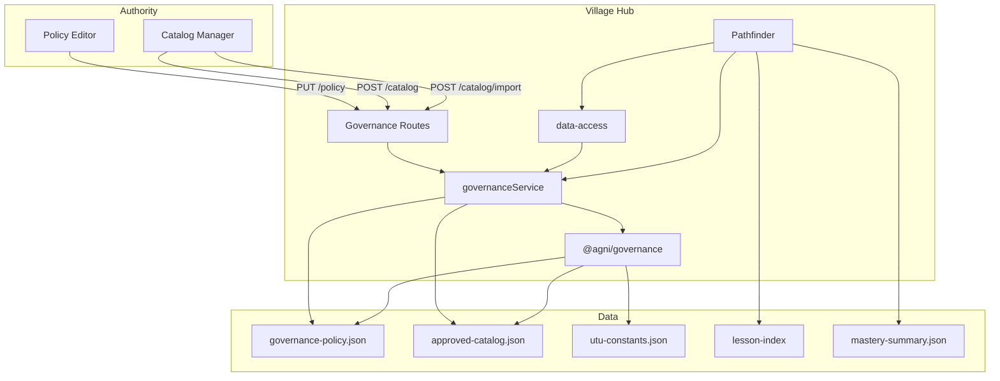

# Governance Architecture — Detailed Specification

**Canonical architecture document for the AGNI governance subsystem.** This document provides a thorough description of how governance works: policy, compliance, catalog, cohort coverage, and integration with the Hub Kernel.

## Table of Contents

1. [Overview and Purpose](#1-overview-and-purpose)
2. [Architectural Layers](#2-architectural-layers)
3. [Data Model](#3-data-model)
4. [Policy Evaluation (Compliance)](#4-policy-evaluation-compliance)
5. [Approved Catalog Operations](#5-approved-catalog-operations)
6. [Cohort Coverage Reporting](#6-cohort-coverage-reporting)
7. [Pathfinder Integration](#7-pathfinder-integration)
8. [HTTP API](#8-http-api)
9. [Configuration](#9-configuration)
10. [UTU Architecture (Summary)](#10-utu-architecture-summary)
11. [Pure Core vs Edges](#11-pure-core-vs-edges)
12. [Schemas and Types](#12-schemas-and-types)
13. [Extensibility](#13-extensibility)
14. [Related Documents](#14-related-documents)
15. [Data Flow Diagram](#15-data-flow-diagram)
16. [Portal Consumption](#16-portal-consumption)
17. [Anti-Patterns and Don'ts](#17-anti-patterns-and-donts)
18. [Verification and Guards](#18-verification-and-guards)

---

## 1. Overview and Purpose

### 1.1 What Governance Is

Governance in AGNI enables **sovereign curriculum control**. Communities (schools, districts, regional authorities) define:

- **What subjects and skills** lessons must cover (UTU targets)
- **What teaching methods** are allowed (didactic, socratic, guided discovery, etc.)
- **What difficulty range** is appropriate for their students
- **Which lessons are approved** for use in their schools

Governance enforces these policies automatically. Lessons that do not meet criteria are flagged as non-compliant; when `enforceUtuTargets` is enabled, non-matching lessons are excluded from scheduling.

### 1.2 Core Design Principles

| Principle | Description |
|-----------|-------------|
| **Data-driven** | Policy is JSON; authorities change rules without code edits. |
| **Pure evaluation** | `evaluateLessonCompliance(sidecar, policy)` is a pure function: (data in) → (result out). No I/O in the core. |
| **Schema-validated** | Policy and catalog conform to JSON Schema; load/save validate before persist. |
| **Sovereign** | Each hub sets its own policy and catalog. Import/export enable sharing across authorities. |
| **Advisory vs enforced** | Policy can be advisory (report-only) or enforced (scheduling excludes non-compliant lessons). |

---

## 2. Architectural Layers

Governance is implemented in three layers:

```
┌─────────────────────────────────────────────────────────────────────────────┐
│  HTTP Routes (packages/agni-hub/routes/governance.js)                        │
│  GET/PUT /api/governance/* — authOnly / adminOnly                            │
└─────────────────────────────────────────────────────────────────────────────┘
                                      │
                                      ▼
┌─────────────────────────────────────────────────────────────────────────────┐
│  Service Layer (packages/agni-services/governance.js)                        │
│  Caching, default policy injection, path resolution                          │
└─────────────────────────────────────────────────────────────────────────────┘
                                      │
                                      ▼
┌─────────────────────────────────────────────────────────────────────────────┐
│  Governance Module (packages/agni-governance/)                               │
│  policy.js | catalog.js | evaluateLessonCompliance.js | aggregateCohortCoverage.js │
└─────────────────────────────────────────────────────────────────────────────┘
```

### 2.1 Module Layer (`@agni/governance`)

| File | Responsibility |
|------|----------------|
| `policy.js` | Load, save, validate governance policy against `governance-policy.schema.json`. Uses `schema-store.js`. |
| `catalog.js` | Load, save, update, import approved catalog against `approved-catalog.schema.json`. |
| `evaluateLessonCompliance.js` | Pure evaluation: (sidecar, policy) → `{ status, issues }`. Exports `lessonPassesUtuTargets` for theta filtering. |
| `aggregateCohortCoverage.js` | Aggregate coverage by UTU and by skill from lesson index + mastery summary. |
| `schema-store.js` | Generic Ajv-backed JSON store: validate-on-load, validate-on-save, mkdir-on-save, fallback-on-error. |

### 2.2 Service Layer (`@agni/services`)

The governance service wraps the module with:

- **Policy cache** — `loadPolicy()` caches in memory when called without a path; `savePolicy()` invalidates cache on success.
- **Default policy injection** — `evaluateLessonCompliance`, `aggregateCohortCoverage`, and `lessonPassesUtuTargets` use `loadPolicy()` when policy is omitted.
- **Path resolution** — Default paths come from `@agni/utils/env-config`; callers can override per-call.

### 2.3 Hub Kernel Integration

- **Context:** `packages/agni-hub/context/services.js` provides `governanceService` to all routes.
- **Data access:** `loadApprovedCatalogAsync` in `context/data-access.js` delegates to `governanceService.loadCatalog`.
- **Pathfinder:** Uses `governanceService.loadPolicy()`, `lessonPassesUtuTargets()`, and `loadApprovedCatalogAsync()` to filter eligible lessons.
- **Cache invalidation:** When catalog is updated or imported via POST, `pathfinderCache.clear()` is called.

---

## 3. Data Model

### 3.1 Governance Policy

**Schema:** `schemas/governance-policy.schema.json`  
**Type:** `GovernancePolicy` (from `packages/types/generated/governance-policy.d.ts`)  
**Default file:** `{DATA_DIR}/governance-policy.json`

| Field | Type | Description |
|-------|------|-------------|
| `utuTargets` | `Array<{ class, band, protocol? }>` | Target UTU coordinates for cohort coverage. Each target specifies Spine + Band (1–6), optionally Protocol (1–5). |
| `allowedTeachingModes` | `string[]` | Teaching modes permitted (e.g. `direct`, `socratic`, `guided_discovery`, `constructivist`, `narrative`, `didactic`). |
| `minDifficulty` | `number` (1–5) | Minimum lesson difficulty. |
| `maxDifficulty` | `number` (1–5) | Maximum lesson difficulty. |
| `requireUtu` | `boolean` | If true, lessons must have `meta.utu.class`. |
| `requireTeachingMode` | `boolean` | If true, lessons must declare `meta.teaching_mode`. |
| `allowedProtocols` | `number[]` (1–5) | Pedagogical protocols permitted (P1–P5). |
| `minProtocol` | `number` (1–5) | Minimum protocol for rigor bounds. |
| `maxProtocol` | `number` (1–5) | Maximum protocol for rigor bounds. |
| `failureModeHints` | `boolean` | Include failure-mode hint when protocol check fails (from `utu-constants.json`). |
| `enforceUtuTargets` | `boolean` | When true, pathfinder excludes lessons whose UTU band does not match any target. Override via `utuBandOverrides` in catalog. |

### 3.2 Approved Catalog

**Schema:** `schemas/approved-catalog.schema.json`  
**Default file:** `{DATA_DIR}/approved-catalog.json`

| Field | Type | Description |
|-------|------|-------------|
| `lessonIds` | `string[]` | List of approved lesson identifiers. When non-empty, pathfinder filters eligible lessons to this set. |
| `utuBandOverrides` | `Record<string, { at, reason? }>` | Lesson IDs with explicit UTU band override. When `enforceUtuTargets` is true, these lessons remain eligible despite band mismatch. `at` is ISO8601; `reason` is optional. |
| `provenance` | `object` | Optional: `sourceAuthorityId`, `exportedAt`, `version` — set when catalog was imported from another authority. |

**Invariant:** Lessons in `lessonIds` must exist in the lesson index (built from IR sidecars). Pathfinder does not validate existence; missing lessons simply produce no eligible candidate.

### 3.3 Lesson Sidecar (Input to Compliance)

The compliance evaluator reads from the lesson sidecar (`index-ir.json` or equivalent). Relevant fields:

| Field | Description |
|-------|-------------|
| `identifier` / `lessonId` | Lesson ID. |
| `utu` | `{ class?, band?, protocol? }` — UTU coordinates. `class` is Spine ID (e.g. MAC-2, SCI-1). |
| `teaching_mode` | e.g. `direct`, `socratic`, `guided_discovery`. |
| `difficulty` | 1–5 (from inference or declared). |
| `ontology` | `{ requires, provides }` — for coverage aggregation. |
| `inferredFeatures` | `{ confidence?, featureSources? }` — used for low-confidence warnings. |
| `skillsProvided` | Derived from `ontology.provides` for coverage. |

---

## 4. Policy Evaluation (Compliance)

### 4.1 evaluateLessonCompliance

**Signature:** `evaluateLessonCompliance(sidecar, policy?, opts?) → { status, issues }`

- **status:** `'ok' | 'warning' | 'fail'`
- **issues:** `Array<{ message: string, severity: 'fail' | 'warning' }>`

**Classification:** If any issue has `severity === 'fail'`, status is `'fail'`. Otherwise, if any issue exists, status is `'warning'`. No issues → `'ok'`.

### 4.2 Policy Rules (in order of application)

| Rule | Condition | Severity | Notes |
|------|-----------|----------|-------|
| Require UTU | `requireUtu` and no `sidecar.utu.class` | warning | |
| Spine portability | `utu.class` not in canonical spine list (`utu-constants.json`) | warning | Lesson may not be portable across authorities. |
| UTU target match | `requireUtu` and UTU coordinates don't match any `utuTargets` | fail | |
| Require teaching mode | `requireTeachingMode` and no `sidecar.teaching_mode` | warning | |
| Allowed teaching modes | `teaching_mode` not in `allowedTeachingModes` | fail | |
| Allowed protocols | `utu.protocol` not in `allowedProtocols` | fail | Optionally adds failure-mode hint. |
| Min/max protocol | `utu.protocol` outside `minProtocol`/`maxProtocol` | fail | |
| Inferred feature confidence | Low confidence in blooms/vark/teachingStyle and not declared | warning | Suggests adding `meta.declared_features`. |
| Difficulty bounds | `difficulty` outside `minDifficulty`/`maxDifficulty` | fail | |

### 4.3 UTU Constants

**File:** `data/utu-constants.json` (or `AGNI_UTU_CONSTANTS`)

Used for:

- **Canonical spine IDs** — Validation that lesson's `utu.class` is in the known set (MAC-*, SCI-*, SOC-*).
- **Protocol failure modes** — When `failureModeHints` is true, adds a hint describing the cognitive failure mode for a protocol (e.g. P3 → "Mimicry: execution without underlying abstraction").
- **Archetypes** — `GET /api/governance/archetypes` uses `@agni/utils/archetype-match` filtered by band/protocol.

**Pure testing:** Pass `opts.utuConstants` to `evaluateLessonCompliance` to avoid file I/O.

### 4.4 lessonPassesUtuTargets (Scheduling Filter)

**Signature:** `lessonPassesUtuTargets(lesson, policy, opts?) → boolean`

Used by pathfinder when `policy.enforceUtuTargets` is true and `policy.utuTargets` is non-empty.

- Returns `true` if policy does not enforce UTU targets.
- Returns `true` if lesson is in `opts.utuBandOverrideLessonIds` (from catalog `utuBandOverrides`).
- Returns `false` if lesson has no UTU or `utu.class` missing.
- Returns `true` if lesson's UTU matches any target (class, band, protocol if specified).

**Pure function:** No I/O. Used in the hot path of `getLessonsSortedByPathfinder`.

---

## 5. Approved Catalog Operations

### 5.1 loadCatalog / saveCatalog

- **loadCatalog(filePath?):** Returns catalog object or `{ lessonIds: [] }` when file missing/invalid.
- **saveCatalog(catalog, filePath?):** Validates against schema; on failure returns `{ ok: false, error }`; on success returns `{ ok: true }`.

### 5.2 updateCatalog

**Signature:** `updateCatalog(opts) → { ok, catalog?, error? }`

**opts:**

- `add?: string[]` — Add lesson IDs.
- `remove?: string[]` — Remove lesson IDs.
- `lessonIds?: string[]` — Replace entire list (deduped).

If both `add`/`remove` and `lessonIds` are provided, `lessonIds` takes precedence.

### 5.3 importCatalog

**Signature:** `importCatalog(imported, strategy) → { ok, catalog?, error? }`

**strategies:**

| Strategy | Behavior |
|----------|----------|
| `replace` | Overwrite current catalog with imported. |
| `merge` | Union of current and imported lesson IDs. |
| `add-only` | Add only IDs not already in current catalog; never remove. |

**Validation:** Imported catalog must pass `validateCatalog`. Provenance is set from imported or defaults to `{ sourceAuthorityId: 'import', exportedAt: now }`.

---

## 6. Cohort Coverage Reporting

### 6.1 aggregateCohortCoverage

**Signature:** `aggregateCohortCoverage(lessonIndex, masterySummary, policy?) → CohortCoverageReport`

**Inputs:**

- **lessonIndex:** Array of lesson entries from pathfinder (each has `lessonId`, `utu`, `skillsProvided`, etc.).
- **masterySummary:** `{ students: { [pseudoId]: { [skillId]: number } } }` — skill levels per student.
- **policy:** Optional; currently used only for filtering (e.g. by `utuTargets`) in future extensions.

**Output (CohortCoverageReport):**

| Field | Description |
|-------|-------------|
| `byUtu` | `Record<utuKey, { lessons, skills, studentMasteryCount }>` — UTU bucket key (e.g. `MAC-2-B4`, `_no_utu`), lesson count, skill IDs, count of students who mastered ≥1 skill in bucket. |
| `bySkill` | `Record<skillId, { lessons, studentMasteryCount }>` — per-skill lesson count and student mastery count. |
| `studentCount` | Number of students in mastery summary. |
| `lessonCount` | Number of lessons in index. |

**Mastery threshold:** Uses `envConfig.masteryThreshold` (default 0.6), aligned with theta and LMS engine.

### 6.2 UTU Bucket Keys

Format: `{class}` or `{class}-B{band}` or `{class}-B{band}-P{protocol}`. Lessons without UTU use `_no_utu`.

---

## 7. Pathfinder Integration

### 7.1 Lesson Filtering Pipeline

In `getLessonsSortedByPathfinder`:

1. **Load catalog** — `loadApprovedCatalogAsync()`.
2. **Catalog filter** — If `catalog.lessonIds.length > 0`, filter candidates to IDs in the approved set.
3. **UTU filter** — If `policy.enforceUtuTargets` and `policy.utuTargets.length > 0`:
   - Build `overrideIds` from `Object.keys(catalog.utuBandOverrides || {})`.
   - Filter candidates with `lessonPassesUtuTargets(l, policy, { utuBandOverrideLessonIds: overrideIds })`.
4. **Skill graph** — Remaining candidates go through theta's `computeLessonOrder` (prerequisites, MLC, LMS).

### 7.2 Lesson Index as Governance Input

The lesson index (`rebuildLessonIndex`) is built from IR sidecars at `serveDir/lessons/{slug}/index-ir.json`. Each entry includes `lessonId`, `utu`, `teaching_mode`, `skillsProvided`, `skillsRequired`, and inferred features. This index is the single source of truth for:

- Pathfinder's eligible-lesson candidates
- `aggregateCohortCoverage` (lessonIndex input)
- Compliance evaluation when run per-lesson via POST `/api/governance/compliance`

Lessons without a valid IR sidecar are not indexed and thus never appear in governance reports or pathfinder.

### 7.3 Cache Invalidation

Pathfinder cache (`pathfinderCache`) is invalidated when:

- `MASTERY_SUMMARY` mtime changes
- `SCHEDULES` mtime changes
- `CURRICULUM_GRAPH` mtime changes
- **`APPROVED_CATALOG` mtime changes**
- `POST /api/governance/catalog` or `POST /api/governance/catalog/import` succeeds → `pathfinderCache.clear()` called immediately

### 7.4 Boundary with LMS and Telemetry

- **Governance** does not depend on the LMS engine or telemetry engine directly.
- **Cohort coverage** consumes `masterySummary`, which is produced by theta/LMS (skill stabilisation from Rasch and gate outcomes). Governance aggregates *what* has been mastered, not *how* it was estimated.
- **Lesson filtering** (catalog, UTU targets) happens before LMS selection. The LMS bandit chooses among governance-approved, theta-eligible lessons.
- **Frustration feedback** (telemetry) adjusts theta ordering but does not change governance eligibility.

---

## 8. HTTP API

All governance routes are under `/api/governance/`. See `docs/api-contract.md` for full contract.

| Method | Path | Auth | Description |
|--------|------|------|-------------|
| GET | `/api/governance/report` | Bearer | `aggregateCohortCoverage(lessonIndex, masterySummary)` — compliance report. |
| GET | `/api/governance/policy` | Bearer | Current policy (or `{}`). |
| PUT | `/api/governance/policy` | Admin | Update policy. Body: policy JSON. |
| GET | `/api/governance/catalog` | Bearer | Approved catalog (or `{ lessonIds: [] }`). |
| POST | `/api/governance/catalog` | Admin | Update catalog. Body: `{ add?, remove?, lessonIds? }`. Clears pathfinder cache. |
| POST | `/api/governance/catalog/import` | Admin | Import catalog. Body: `{ catalog: { lessonIds, provenance? }, strategy }`. Clears pathfinder cache. |
| GET | `/api/governance/utu-constants` | Bearer | UTU constants from `utu-constants.json`. |
| GET | `/api/governance/archetypes` | Bearer | Archetypes from `@agni/utils/archetype-match`. Query: `?band=&protocol=` for filtering. |
| POST | `/api/governance/compliance` | Bearer | Evaluate compliance. Body: sidecar JSON. Returns `{ status, issues }`. |

**Auth:** `authOnly` = creator session (Bearer). `adminOnly` = creator with admin role.

---

## 9. Configuration

### 9.1 Environment Variables

| Env | Default | Description |
|-----|---------|-------------|
| `AGNI_GOVERNANCE_POLICY` | `{DATA_DIR}/governance-policy.json` | Policy file path. |
| `AGNI_GOVERNANCE_POLICY_SCHEMA` | `{DATA_DIR}/../schemas/governance-policy.schema.json` | Policy schema for validation. |
| `AGNI_APPROVED_CATALOG` | `{DATA_DIR}/approved-catalog.json` | Catalog file path. |
| `AGNI_APPROVED_CATALOG_SCHEMA` | `{DATA_DIR}/../schemas/approved-catalog.schema.json` | Catalog schema for validation. |
| `AGNI_UTU_CONSTANTS` | `{DATA_DIR}/utu-constants.json` | UTU Spine IDs, protocols, bands. |

**Bootstrap:** Hub config (`hub-config.json`) can set these before `loadHubConfig()`; env vars override.

### 9.2 Schema Store Behavior

- **Load:** If file missing or invalid JSON, returns `defaults` (empty object for policy, `{ lessonIds: [] }` for catalog).
- **Save:** Validates before write; on schema failure returns `{ ok: false, error }`.
- **mkdir:** `schema-store` creates parent directory if needed on save.

---

## 10. UTU Architecture (Summary)

Governance uses the **UTU (Unit of Teaching and Learning)** 3D coordinate system. Full spec: `docs/specs/utu-architecture.md`.

| Dimension | Values | Role |
|-----------|--------|------|
| **Spine (class)** | MAC-1..8, SCI-1..7, SOC-1..7 | Disciplinary area (math, science, social). |
| **Band** | 1–6 | Developmental level (B1–B2 embodied, B3–B4 operational, B5–B6 formal). |
| **Protocol** | 1–5 | Pedagogical protocol (P1 Transmission → P5 Meaning Activation). |

**Governance logic:**

- **Portability check:** Lesson targets a valid Spine ID and Band.
- **Rigor check:** Protocol progression (P1 → P2 → P3...) can be enforced via `allowedProtocols` or `minProtocol`/`maxProtocol`.
- **Failure analysis:** When `failureModeHints` is true, protocol violations include a hint (e.g. "Mimicry: execution without underlying abstraction" for P3).

---

## 11. Pure Core vs Edges

**Pure core (reference behaviour, testable without I/O):**

- `validatePolicy(policy)`
- `evaluateLessonCompliance(sidecar, policy, opts?)` — when `opts.utuConstants` provided
- `lessonPassesUtuTargets(lesson, policy, opts)`
- `aggregateCohortCoverage(lessonIndex, masterySummary, policy)`

**Edges (I/O, environment):**

- `loadPolicy`, `savePolicy` — file read/write
- `loadCatalog`, `saveCatalog`, `updateCatalog`, `importCatalog` — file read/write
- `evaluateLessonCompliance` — when `opts.utuConstants` not provided, loads from `utuConstantsPath`
- HTTP routes — auth, request/response, pathfinder cache invalidation

---

## 12. Schemas and Types

| Artifact | Location | Purpose |
|----------|----------|---------|
| Governance policy schema | `schemas/governance-policy.schema.json` | Validates policy JSON. |
| Approved catalog schema | `schemas/approved-catalog.schema.json` | Validates catalog JSON. |
| Governance policy type | `packages/types/generated/governance-policy.d.ts` | TypeScript/JSDoc; generated from schema. |
| ComplianceResult | `packages/types/index.d.ts` | `{ status, issues }`. |
| CohortCoverageReport | `packages/types/index.d.ts` | `{ byUtu, bySkill, studentCount, lessonCount }`. |

**Codegen:** `npm run codegen:types` regenerates from schemas.

---

## 13. Extensibility

### 13.1 Adding a New Policy Rule

1. Add the field to `schemas/governance-policy.schema.json`.
2. Implement the check in `evaluateLessonCompliance.js` — read from `policy`, compare to `sidecar`, push to `issues`, set `status`.
3. Document in `docs/api-contract.md` and `packages/types` if needed.
4. Add unit tests in `tests/unit/governance.test.js`.

### 13.2 Changing Coverage Aggregation

Edit `aggregateCohortCoverage.js`. Current structure: `byUtu`, `bySkill`, `studentCount`, `lessonCount`. Policy can be used to filter buckets (e.g. only report on `utuTargets`).

### 13.3 UTU Band Override Workflow

To allow a lesson that doesn't match `utuTargets` when `enforceUtuTargets` is true:

1. Add lesson ID to `approved-catalog.json` → `utuBandOverrides`:
   ```json
   "utuBandOverrides": {
     "lesson-id": { "at": "2026-03-13T00:00:00.000Z", "reason": "Optional explanation" }
   }
   ```
2. Pathfinder will include it via `lessonPassesUtuTargets(..., { utuBandOverrideLessonIds })`.

---

## 14. Related Documents

| Document | Content |
|----------|---------|
| `docs/ARCHITECTURE.md` | System-wide architecture; Hub Kernel, governance in §3.1, §5, §8. |
| `docs/playbooks/governance.md` | How to modify governance (entry points, files to touch). |
| `docs/guides/GOVERNANCE-AUTHORITY.md` | User guide for governance authorities (policy, catalog, report). |
| `docs/specs/utu-architecture.md` | Full UTU Spine/Band/Protocol specification. |
| `docs/api-contract.md` | HTTP API contract. |
| `docs/REFERENCE-IMPLEMENTATION-VISION.md` | Pure core vs edges; governance as reference implementation. |
| `docs/archive/GOVERNANCE-IMPROVEMENT-PLAN.md` | Historical improvement plan (canonical tests, path isolation). |

---

## 15. Data Flow Diagram



---

## 16. Portal Consumption

The Teacher/Admin Portal (`portal/`) consumes governance APIs for:

- **Policy tab** — GET policy, PUT policy, UTU targets, teaching modes, difficulty bounds, requirements.
- **Catalog tab** — GET catalog, add/remove lessons via POST.
- **Import tab** — Import catalog with strategy (replace, merge, add-only).
- **Report tab** — GET report (`aggregateCohortCoverage`), display cohort coverage by UTU and skill.

Portal uses `VITE_HUB_URL` when configured; otherwise mock data. Governance routes require Bearer (authOnly) or Admin (adminOnly).

---

## 17. Anti-Patterns and Don'ts

| Don't | Reason |
|-------|--------|
| Hard-code policy rules in compiler or theta | Keep governance in `@agni/governance`; policy in JSON. |
| Assume sidecar has fields not threaded | `utu`, `teaching_mode` come from IR sidecar; theta index must be built from sidecar. |
| Use raw `yaml.load()` on lesson content | Use `@agni/utils/yaml-safe` or compiler pipeline. |
| Require `src/governance` in tests | Use `@agni/governance` (canonical package). |
| Skip schema validation on policy/catalog save | schema-store validates; invalid data would corrupt enforcement. |

---

## 18. Verification and Guards

| Guard | Command / Location | Purpose |
|-------|--------------------|---------|
| Unit tests | `npm run test -- tests/unit/governance.test.js` | Compliance, policy, catalog, coverage, `lessonPassesUtuTargets`. |
| Canonical imports | `scripts/check-governance-canonical.js` | Tests must require `@agni/governance`, not `src/`. |
| Doc accuracy | `scripts/check-governance-docs.js` | README matches API (signature, result shape). |
| Path wiring | `scripts/check-governance-paths.js` | policy.js and catalog.js use env-config paths. |
| verify:all | `npm run verify:all` | Includes governance-related checks. |
